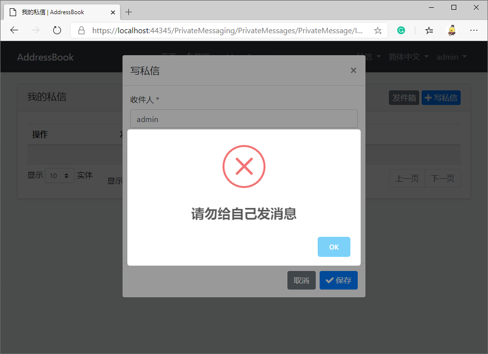

# 给 ABP vNext 应用安装私信模块

在[上一节](../../Using%20ABP%20vNext%20to%20develop%20address%20book%20application%20in%205%20minutes/zh/五分钟完成%20ABP%20vNext%20通讯录%20App%20开发.md)中，我们用完成了通讯录 App 的基础开发。

这本章节，我们会给通讯录 App 安装私信模块，使不同用户能够通过相互发送消息，并接收新私信的通知。在章节的最后，笔者将演示模块的“改装”，实现禁止用户发私信给自己的定制化需求。

## 什么是“模块”？

使用 Abp 框架，你可以提前制作一些功能模块，例如微信登录、私信、博客、论坛等模块，将它们打包备用。在开发具体的 App 应用时，你可以轻松将模块安装到你的工程中，节省了大量的重复性工作。除了自己造轮子，你还可以在 NuGet 上安装由开源社区维护的模块，当然，社区也在等待你的贡献。

## 安装私信模块

笔者用到的私信应用模块（EasyAbp.PrivateMessaging）由 EasyAbp 组织开发并持续维护，你甚至可以在商业项目中免费使用它。现在，笔者将带你一步步给通讯录 App 安装此模块。

### 第一步：使用 NuGet 安装模块包

1. 将 NuGet 包 `EasyAbp.PrivateMessaging.Application`，安装到 `AddressBook.Application` 项目。
1. 将 NuGet 包 `EasyAbp.PrivateMessaging.Application.Contracts`，安装到 `AddressBook.Application.Contracts` 项目。
1. 将 NuGet 包 `EasyAbp.PrivateMessaging.Domain`，安装到 `AddressBook.Domain` 项目。
1. 将 NuGet 包 `EasyAbp.PrivateMessaging.Domain.Shared`，安装到 `AddressBook.Domain.Shared` 项目。
1. 将 NuGet 包 `EasyAbp.PrivateMessaging.EntityFrameworkCore`，安装到 `AddressBook.EntityFrameworkCore` 项目。
1. 将 NuGet 包 `EasyAbp.PrivateMessaging.HttpApi`，安装到 `AddressBook.HttpApi` 项目。
1. 将 NuGet 包 `EasyAbp.PrivateMessaging.HttpApi.Client`，安装到 `AddressBook.HttpApi.Client` 项目。
1. 将 NuGet 包 `EasyAbp.PrivateMessaging.MongoDB`，安装到 `AddressBook.MongoDB` 项目。
1. 将 NuGet 包 `EasyAbp.PrivateMessaging.Web`，安装到 `AddressBook.Web` 项目。（如果你不需要 UI，可以跳过这一步）

### 第二步：添加配置

1. 分别在以上项目的 Module 类中添加私信模块的依赖，例如：在 AddressBookApplicationModule.cs 中添加特性 `[DependsOn(PrivateMessagingApplicationModule)]`，以此类推。

1. 在 AddressBookApplicationModule.cs 中找到 `Configure<AbpAspNetCoreMvcOptions>(options => { ... });`，在里面加一行配置 `options.ConventionalControllers.Create(typeof(PrivateMessagingApplicationModule).Assembly);`，这一步是为了私信模块 WebAPI 的自动生成。

1. 在 AddressBookMigrationsDbContext.cs 中找到 OnModelCreating 方法，在里面加一行 `builder.ConfigurePrivateMessaging();`，使私信模块的 EF Core 迁移能够进行。

### 第三步：创建 EF Core 迁移并更新数据库

不熟悉这块操作的同学可以参考 [Abp 官方手册](https://docs.abp.io/en/abp/latest/Tutorials/Part-1?UI=MVC#add-new-migration-update-the-database)的介绍。

### 第四步：安装完毕

启动 AddressBook.Web 项目，可以看到私信模块已经安装成功了。


进一步了解 EasyAbp 私信模块：https://github.com/EasyAbp/PrivateMessaging

## 改进模块：禁止用户发私信给自己

Abp vNext 框架支持应用对模块代码的重写，在 AddressBook.Application 项目中新建 MyPrivateMessageAppService.cs
```
    public class MyPrivateMessageAppService : PrivateMessageAppService
    {
        public MyPrivateMessageAppService(IDataFilter dataFilter,
            IExternalUserLookupServiceProvider externalUserLookupServiceProvider,
            IPrivateMessageRepository privateMessageRepository, IPrivateMessageNotificationManager notificationManager,
            IPrivateMessageSenderSideManager privateMessageSenderSideManager,
            IPrivateMessageReceiverSideManager privateMessageReceiverSideManager) : base(dataFilter,
            externalUserLookupServiceProvider, privateMessageRepository, notificationManager,
            privateMessageSenderSideManager, privateMessageReceiverSideManager)
        {
        }

        public override Task<PrivateMessageDto> CreateAsync(CreateUpdatePrivateMessageDto input)
        {
            if (input.ToUserName == CurrentUser.UserName)
            {
                throw new UserFriendlyException("请勿给自己发消息");
            }
            
            return base.CreateAsync(input);
        }
    }
```

效果展示


## 后记

等到不久的将来 Abp 官方模块商城 market.abp.io 上线，文中手动安装模块的方式将成为历史，你只需要按一个键，模块就自动安装好了。在此之前，AbpHelper 可能会先开发一个简易的模块安装器，如果你有需要，请关注我们的进展：https://github.com/EasyAbp/EasyAbpGuide

## 下一节

在下一节中，笔者将会介绍，如何通过一个改动，让我们的通讯录 App 升级为多租户 SaaS 系统。
