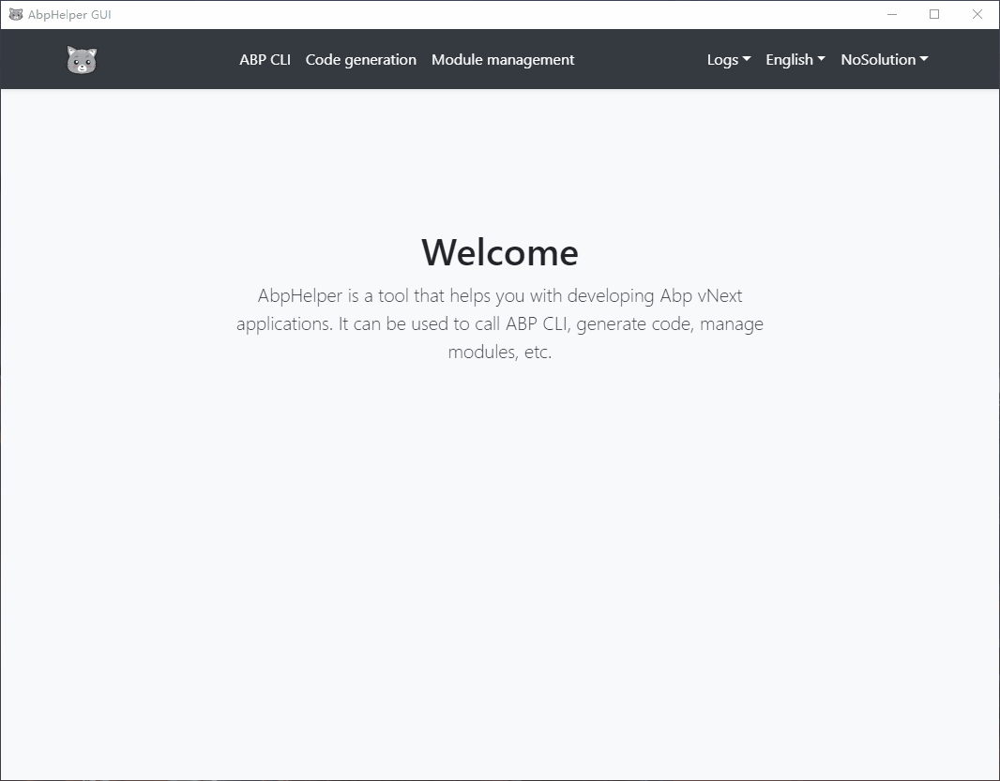
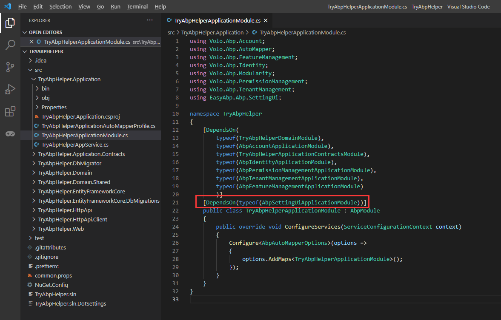
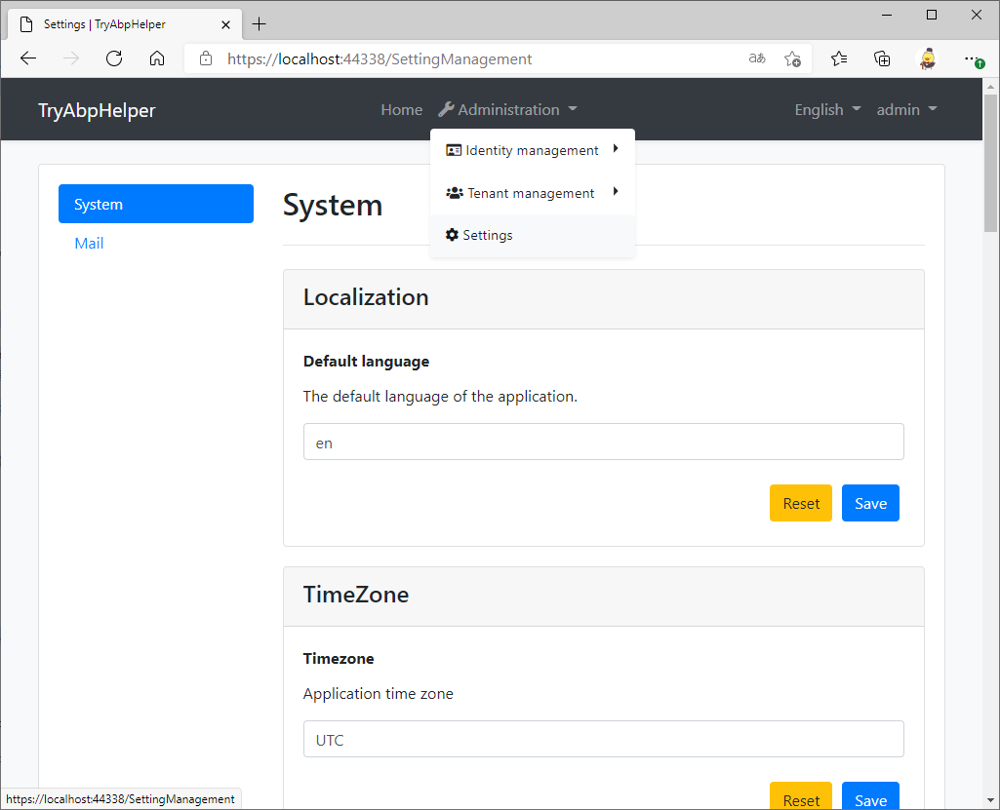

# Install modules with one click via AbpHelper GUI

## Introduction

In this article, we will use the AbpHelper GUI to install the [EasyAbp.Abp.SettingUi](https://github.com/EasyAbp/Abp.SettingUi) module into your ABP application.

## Pre-Requirements

The following tools should be installed on your development machine:

* [.NET Core 5.0+](https://www.microsoft.com/net/download/dotnet-core/)
* [VS Code](https://code.visualstudio.com/) or another IDE
* [AbpHelper GUI 1.0+](https://github.com/EasyAbp/AbpHelper.GUI/releases)

## Creating a New Solution

Open the AbpHelper GUI, switch to the "ABP CLI" tab, and create a new app:



## Install the SettingUi Modules

Open the new app solution in the AbpHelper GUI and install the modules:


Then we will find that the `DependsOn`s have been added:



## Run the App

> See https://docs.abp.io/en/abp/latest/Getting-Started-Running-Solution to learn more about how to run an ABP solution.

Run the commands:

```bash
cd C:\\Temp\\TryAbpHelper\\src\\TryAbpHelper.DbMigrator
dotnet run
cd ..\\TryAbpHelper.Web
dotnet run
```

Log in and try the Setting UI:



> Use the username `admin` and the password `1q2w3E*`.

## Conclusion

AbpHelper is helpful for us to manage the application's modules. We can use it to install not only Volosoft's modules but also the community modules.

The module management feature of the AbpHelper depends on EasyAbp's [module library](https://github.com/EasyAbp/ModuleLibrary), welcome to register your developed modules through PR.