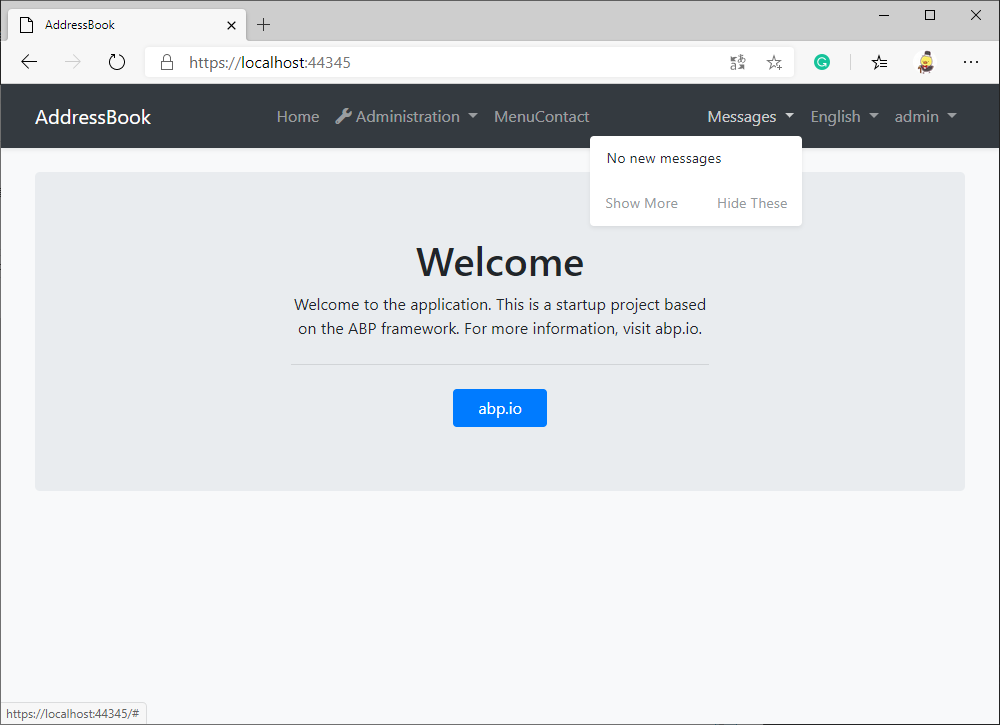
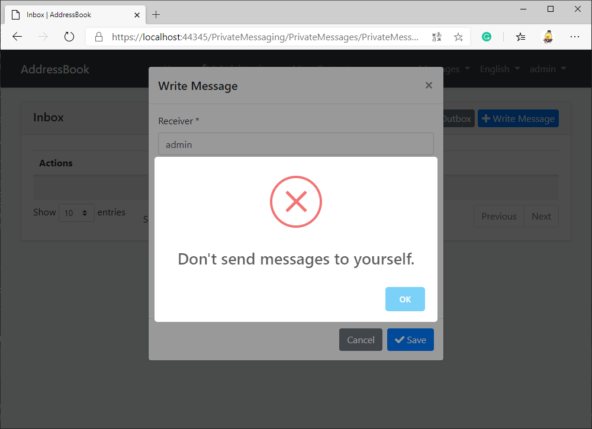

# Reuse ABP vNext Modules to Quickly Implement Application Features

In the [previous article](../../Using-ABP-VNext-To-Develop-An-Address-Book-Application-In-5-Minutes/zh/article.md), we have completed the basic features of the address book application.

In this article, we will install the **PrivateMessaging** module to our address book application, so that users can send private messages to each other and get new message notifications on the website.

In the design of the private messaging module, users can send private messages to themselves, but we will override the design to prohibit users from sending private messages to themselves at the end of this article.

## What Is a Module in ABP Framework?

Using the ABP framework, you can make some modules in advance, such as external login implementation, private messaging, file upload, blog, forum, and other modules, and package them for later use. When developing a specific application, you can easily install modules into your application, saving a lot of repetitive work.

In addition to making your own modules, you can also install modules maintained by the open-source community on NuGet. Of course, the community is also waiting for your contribution.

## Install the Private Messaging Module

The module (EasyAbp.PrivateMessaging) we use is developed and maintained by the [EasyAbp](https://easyabp.io) organization, and you can even use it for free in commercial applications.

Now we will start to install the module step by step.

### Step 1: Install the Module's NuGet Packages

1. Install the NuGet package `EasyAbp.PrivateMessaging.Application` to the `AddressBook.Application` project.
2. Install the NuGet package `EasyAbp.PrivateMessaging.Application.Contracts` to the `AddressBook.Application.Contracts` project.
3. Install the NuGet package `EasyAbp.PrivateMessaging.Domain` to the `AddressBook.Domain` project.
4. Install the NuGet package `EasyAbp.PrivateMessaging.Domain.Shared` to the `AddressBook.Domain.Shared` project.
5. Install the NuGet package `EasyAbp.PrivateMessaging.EntityFrameworkCore` to the `AddressBook.EntityFrameworkCore` project.
6. Install the NuGet package `EasyAbp.PrivateMessaging.HttpApi` into the `AddressBook.HttpApi` project.
7. Install the NuGet package `EasyAbp.PrivateMessaging.HttpApi.Client` into the `AddressBook.HttpApi.Client` project.
8. Install the NuGet package `EasyAbp.PrivateMessaging.Web` into the `AddressBook.Web` project (you can skip this step if you do not need the UI).

### Step 2: Add Module Dependencies and Configurations

1. Add the dependency of the module to the module class of the above projects, for example, we add the attribute `[DependsOn(PrivateMessagingApplicationModule)]` to the class in the **AddressBookApplicationModule.cs** of the AddressBook.Application project, and so on.

2. Find the **OnModelCreating** method in **AddressBookMigrationsDbContext.cs** of the AddressBook.EntityFrameworkCore.DbMigrations project and add the code `builder.ConfigurePrivateMessaging();` to it to configure the EF Core migration of the module.

### Step 3: Create EF Core Migration and Update the Database

1. Run the command `dotnet ef migrations add Installed_Pm_Module -s ../AddressBook.DbMigrator` in the directory of AddressBook.EntityFrameworkCore.DbMigrations project.

2. Run the AddressBook.DbMigrator project, it will automatically update the database.

If you want to learn more about this step, you can read the [ABP official documentation](https://docs.abp.io/en/abp/latest/Tutorials/Part-1#add-database-migration).

### Step 4: Run the Application

Now run the AddressBook.Web project, we can see that the private messaging module has been installed successfully.



## Improved: Prohibit Users From Sending Private Messages to Themselves

The ABP framework allows us to override the code in the module. Please create a new file `MyPrivateMessageAppService.cs` in the AddressBook.Application project:
```csharp
[Dependency(ReplaceServices = true)]
public class MyPrivateMessageAppService: PrivateMessageAppService
{
    // ctor

    public override Task<PrivateMessageDto> CreateAsync(CreateUpdatePrivateMessageDto input)
    {
        if (input.ToUserName == CurrentUser.UserName)
        {
            throw new UserFriendlyException("Don't send messages to yourself");
        }
        
        return base.CreateAsync(input);
    }
}
```

If a user sends a message to himself, he will see the error message:



Thanks to the extensible modular design of the ABP framework, static files (such as JS and CSS files) and pages can be overridden. Please read the ABP official document for more information: [Customizing the Existing Modules](https://docs.abp.io/en/abp/latest/Customizing-Application-Modules-Guide)

## Postscript

If you want to learn more about the private messaging module, please read its [documentation](https://easyabp.io/modules/PrivateMessaging).

By the way, the EasyAbp organization has many powerful and useful modules, such as EShop, PaymentService, GiftCardManagement, which can improve your development efficiency and enhance the reliability of applications. If you are interested, please read [EasyAbp Guide](https://github.com/EasyAbp/EasyAbpGuide) to learn more.

I look forward to the launch of ABP's official module market (market.abp.io) in the future, providing community modules list, search, and automatic installation features, making it easier for us to install modules.

## Next

In the next article, we will upgrade the address book application to a multi-tenant SaaS application with a minor change.