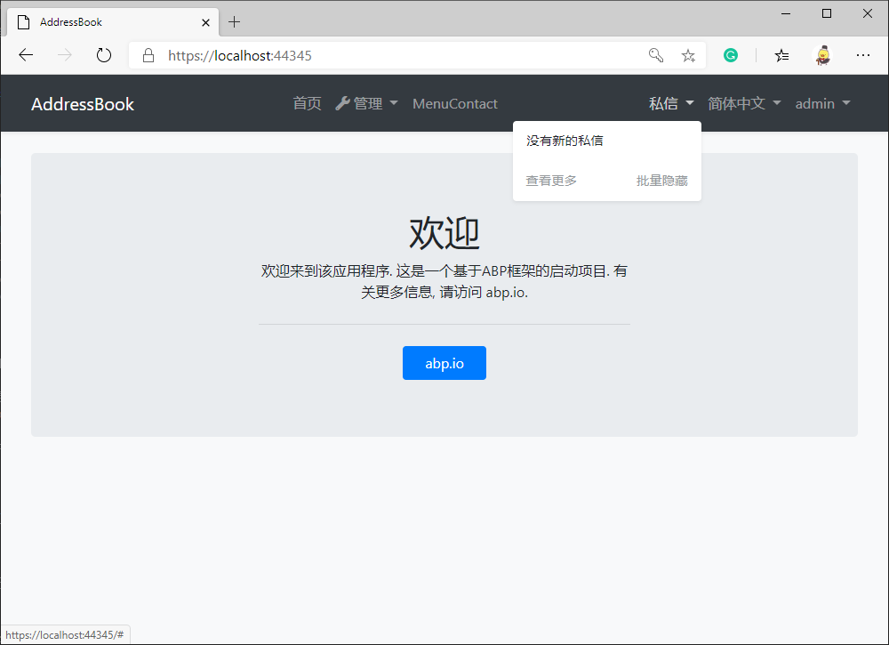
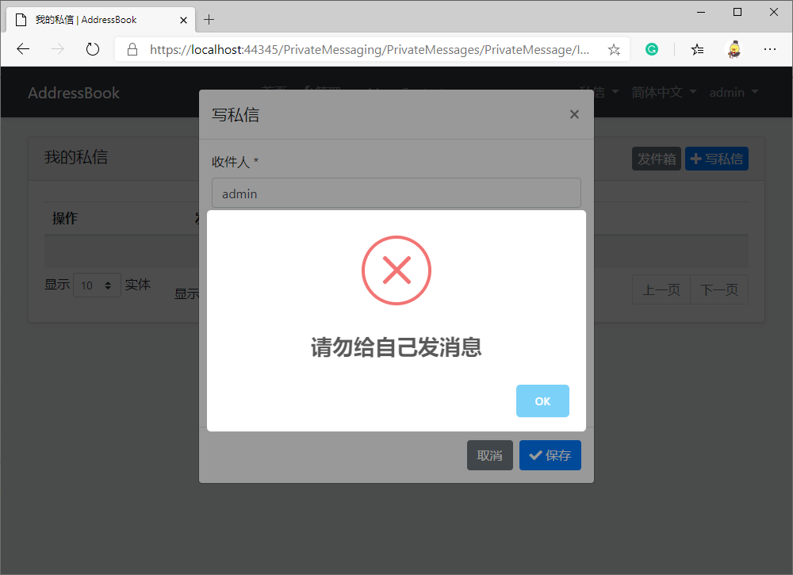

# 复用 ABP vNext 的模块以快速实现应用的功能

在[上一篇](../../Using-ABP-VNext-To-Develop-An-Address-Book-Application-In-5-Minutes/zh/article.md)中，我们用完成了通讯录 App 的基本功能开发。

本篇，我们会给通讯录 App 安装私信模块，使用户能够相互发送私信，并接收新私信的通知。在私信模块的设计里，用户可以发送私信给自己，但在本篇的最后，我们还要“改装”私信模块，从而禁止用户发送私信给自己。

## 什么是“模块”？

使用 Abp 框架，你可以提前制作一些功能模块，例如微信登录、私信、博客、论坛等模块，将它们打包备用。在开发具体的应用时，你可以轻松将模块安装到你的工程中，节省了大量的重复性工作。

除了自己造轮子，你还可以在 NuGet 上安装由开源社区维护的模块，当然，社区也在等待你的贡献。

## 安装私信模块

我们用到的私信应用模块（EasyAbp.PrivateMessaging）由 [EasyAbp](https://easyabp.io) 组织开发并持续维护，你甚至可以在商业项目中免费使用它。

现在，我们将一步步给通讯录 App 安装上私信模块。

### 第一步：使用 NuGet 安装模块包

1. 将 NuGet 包 `EasyAbp.PrivateMessaging.Application`，安装到 `AddressBook.Application` 项目
2. 将 NuGet 包 `EasyAbp.PrivateMessaging.Application.Contracts`，安装到 `AddressBook.Application.Contracts` 项目
3. 将 NuGet 包 `EasyAbp.PrivateMessaging.Domain`，安装到 `AddressBook.Domain` 项目
4. 将 NuGet 包 `EasyAbp.PrivateMessaging.Domain.Shared`，安装到 `AddressBook.Domain.Shared` 项目
5. 将 NuGet 包 `EasyAbp.PrivateMessaging.EntityFrameworkCore`，安装到 `AddressBook.EntityFrameworkCore` 项目
6. 将 NuGet 包 `EasyAbp.PrivateMessaging.HttpApi`，安装到 `AddressBook.HttpApi` 项目
7. 将 NuGet 包 `EasyAbp.PrivateMessaging.HttpApi.Client`，安装到 `AddressBook.HttpApi.Client` 项目
8. 将 NuGet 包 `EasyAbp.PrivateMessaging.Web`，安装到 `AddressBook.Web` 项目（如果你不需要 UI，可以跳过这一步）

### 第二步：添加配置

1. 分别在以上项目的 Module 类中添加私信模块的依赖，例如：在 AddressBook.Application 项目的 AddressBookApplicationModule.cs 中给类添加特性 `[DependsOn(PrivateMessagingApplicationModule)]`，以此类推

2. 在 AddressBook.EntityFrameworkCore.DbMigrations 项目的 AddressBookMigrationsDbContext.cs 中找到 OnModelCreating 方法，在它里面添加代码 `builder.ConfigurePrivateMessaging();`，使私信模块的 EF Core 迁移能够进行

### 第三步：创建 EF Core 迁移并更新数据库

1. 在 AddressBook.EntityFrameworkCore.DbMigrations 项目目录中打开命令行，执行命令 `dotnet ef migrations add Installed_Pm_Module -s ../AddressBook.DbMigrator`

2. 运行 AddressBook.DbMigrator 项目，它将自动完成数据库的更新

如果你感兴趣，不妨阅读 [Abp 官方文档](https://docs.abp.io/en/abp/latest/Tutorials/Part-1#add-database-migration)了解更多。

### 第四步：安装完毕

启动 AddressBook.Web 项目，我们可以看到私信模块已经安装成功了。


## 改进模块：禁止用户发私信给自己

Abp vNext 框架支持对模块代码的重写，我们在 AddressBook.Application 项目中新建 `MyPrivateMessageAppService.cs`：
```csharp
[Dependency(ReplaceServices = true)]
public class MyPrivateMessageAppService : PrivateMessageAppService
{
    // ctor

    public override Task<PrivateMessageDto> CreateAsync(CreateUpdatePrivateMessageDto input)
    {
        if (input.ToUserName == CurrentUser.UserName)
        {
            throw new UserFriendlyException("请勿给自己发消息");
        }
        
        return base.CreateAsync(input);
    }
}
```

此时如果用户发送邮件给自己，会看到错误提示信息：


得益于 Abp 框架高可扩展性的模块化设计，JS 和 CSS 等静态文件以及页面均可被重写，请阅读官方文档以了解更多用法：[Customizing the Existing Modules](https://docs.abp.io/en/abp/latest/Customizing-Application-Modules-Guide)

## 后记

如果你希望进一步了解 PrivateMessaging 模块，请阅读[它的文档](https://easyabp.io/modules/PrivateMessaging)。当然，EasyAbp 组织还有更多强大又实用的模块，例如：EShop、PaymentService、GiftCard，它们可以真正提升你的开发效率，并且加强应用程序的可靠性。

笔者也期待将来 Abp 官方模块商城 market.abp.io 正式发布，提供社区模块的展示、检索和自动安装功能，从而使得我们安装模块更加容易。

## 下一篇

下一篇，我们将通过一个简单的改动，让我们的通讯录 App 升级为多租户 SaaS 应用。
