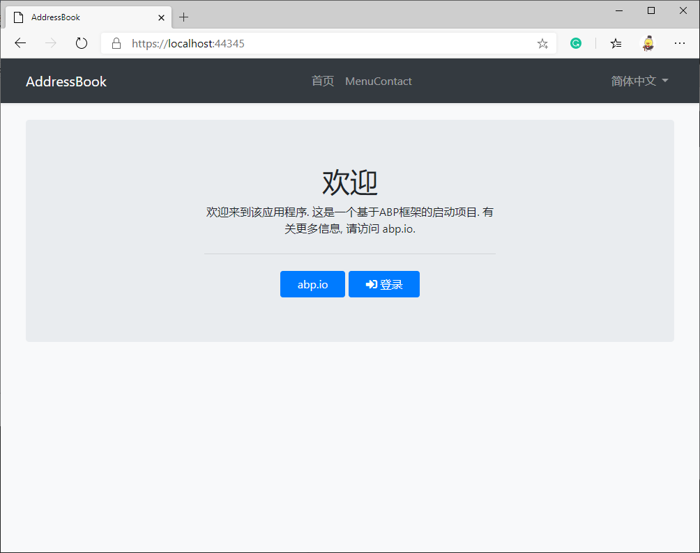

# 五分钟完成 ABP vNext 通讯录 App 开发

ABP vNext（后文简称Abp）是 Volo 公司堪称艺术品级的应用开发框架，它基于领域驱动设计（DDD）的思维，创新地采用了模块化的设计。Abp 目前无疑是 ASP.NET Core 开发框架中最先进和最优雅的存在。笔者认为，凭借绝妙的模块化设计和丝滑的开发体验，Abp 有望超越 Spring 家族在历史上的影响力。

## 模块开发与应用开发的关系

使用 Abp 框架，你可以提前制作一些功能模块，例如微信登录、私信、博客、论坛等模块，将它们打包备用。在开发具体的 App 应用时，你可以轻松将模块安装到你的工程中，节省了大量的重复性工作。除了自己造轮子，你还可以在 NuGet 上安装由开源社区维护的模块，当然，社区也在等待你的贡献。

## 五分钟完成通讯录 App 开发

今天我们不讲模块开发，而是从最简单的应用开发入手，笔者将遵循 Abp 最佳实践，带你体验如何在 5 分钟内，使用 Abp 框架开发一个通讯录 App。

### 第一步：使用 ABP CLI 生成项目

1. 命令行安装 ABP CLI：`dotnet tool install -g Volo.Abp.Cli`

2. 命令行生成通讯录 App 项目：`abp new AddressBook`（将在当前目录中生成项目）

### 第二步：创建“联系人”实体

在 Abp 中，联系人应为聚合根 AggregateRoot，详细请参考 Abp 官方手册对于领域驱动设计（DDD）的讲解。

1. 新建 aspnet-core/src/AddressBook.Domain/Contacts 目录

2. 在目录下手动创建 Contact.cs 文件

```
    public class Contact : AggregateRoot<Guid>
    {
        public virtual string Name { get; protected set; }
        
        public virtual string PhoneNumber { get; protected set; }
        
        public virtual string Address { get; protected set; }
        
        public virtual byte? Age { get; protected set; }
        
        public virtual DateTime? Birthday { get; protected set; }
        
        protected Contact() { }

        public Contact(
            Guid id,
            string name,
            string phoneNumber,
            string address,
            byte? age,
            DateTime? birthday) : base(id)
        {
            Name = name;
            PhoneNumber = phoneNumber;
            Address = address;
            Age = age;
            Birthday = birthday;
        }
    }
```

3. 运行 Address.DbMigrator 项目，这是为了给数据库建立基础结构和数据

### 第三步：使用 AbpHelper 生成剩余代码

1. 下载 AbpHelper GUI：https://github.com/EasyAbp/AbpHelper.GUI/releases

2. 使用 Code Generator 功能，一键生成与 Contact 相关的全套代码：


> 如果你是第一次使用，请通过左侧的 Install or update AbpHelper CLI module 安装 CLI 工具

> 如果你更习惯命令行操作，可以直接使用 AbpHelper CLI：https://github.com/EasyAbp/AbpHelper.CLI

### 第四步：开发完毕

1. 启动 AddressBook.Web 项目


2. 登录并使用通讯录（admin 用户的默认密码是 `1q2w3E*`）


你一定注意到了，表单已被 abp-dynamic-form TagHelper 自动生成。另外，你只需要简单的修改本地化文件，就能显示出中文词汇，这里我们不做演示。

3. Contact 的 RESTful API 也已经自动生成，如果需要它们，访问路由 /swagger

## 后记

我们的通讯录项目天然包含：用户权限角色管理、多租户 SaaS 支持，如果你打算系统的学习 Abp 框架，请阅读官方手册：https://docs.abp.io

文中使用的 AbpHelper 是由国内爱好者创建的 EasyAbp 开源组织制作的开发工具集，能明显提高你的开发效率，并且完全免费。此外，EasyAbp 还提供了很多实用的模块，了解更多：https://github.com/EasyAbp/EasyAbpGuide

## 下一节

在下一节中，笔者将会介绍，如何给通讯录安装私信模块。此模块由 EasyAbp 组织开发并持续维护，你甚至可以在商业项目中免费使用它。
