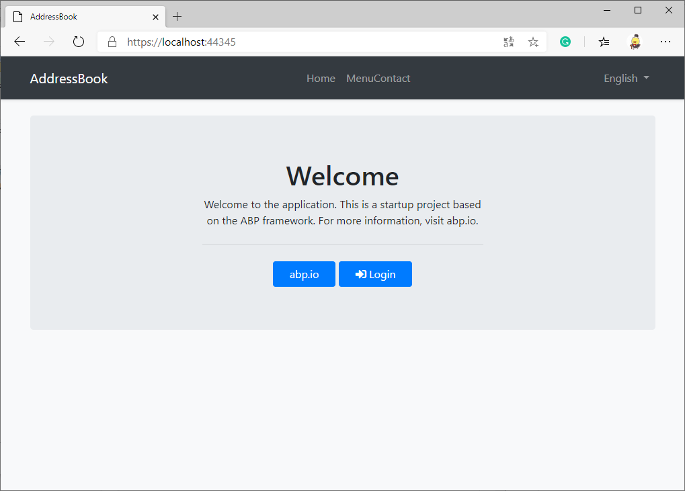

# Using ABP vNext to Develop an Address Book Application in 5 Minutes

ABP vNext framework (hereinafter called "ABP") is an artwork-level application development framework designed by Volosoft. It is based on Domain-Driven-Design (DDD) and innovatively adopts modular development design. ABP is undoubtedly the most advanced and elegant existence in ASP.NET Core development frameworks.

I believe that with the excellent modular development design and smooth development experience, ABP's position in ASP.NET Core is expected to reach the position of Spring in Java.

## Module Development and Application Development

Using the ABP framework, you can make some modules in advance, such as external login implementation, private messaging, file upload, blog, forum, and other modules, and package them for later use. When developing a specific application, you can easily install modules into your application, saving a lot of repetitive work.

In addition to making your own modules, you can also install modules maintained by the open-source community on NuGet. Of course, the community is also waiting for your contribution.

## Start to Develop the Address Book Application

Today we will not discuss module development, but start with the simplest application development. I will follow the ABP best practices and show you how to develop an address book application using Abp vNext framework in 5 minutes.

### Step 1: Use ABP CLI to Generate the Application Solution

1. Use the command line to install ABP CLI: `dotnet tool install -g Volo.Abp.Cli`.

2. Use the command line to generate a solution: `abp new AddressBook` (the solution will be generated in the current directory).

### Step 2: Create a "Contact" Entity

For ABP, the contact entity should be an AggregateRoot. For details, please refer to the introduction of Domain-Driven-Design (DDD) in the [ABP official document](https://docs.abp.io/en/abp/latest/Domain-Driven-Design).

1. Create a new directory: `aspnet-core/src/AddressBook.Domain/Contacts`.

2. Manually create the `Contact.cs` file in the above directory.

    ```csharp
    public class Contact : AggregateRoot<Guid>
    {
        public virtual string Name { get; protected set; }
        
        public virtual string PhoneNumber { get; protected set; }
        
        public virtual string Address { get; protected set; }
        
        public virtual byte? Age { get; protected set; }
        
        public virtual DateTime? Birthday { get; protected set; }

        // The constructors will be generated later, you don’t need to add them manually here.
    }
    ```

3. Run the `AddressBook.DbMigrator` project, which is to establish the basic structure and data in the database for our application.

### Step 3: Generate the Remaining Code

This article uses EasyAbp's open-source [AbpHelper GUI](https://easyabp.io/abphelper/AbpHelper.GUI) to generate code. If you are an ABP commercial user, you can also choose [ABP Suite](https://commercial.abp.io/tools/suite).

1. Download AbpHelper GUI: https://github.com/EasyAbp/AbpHelper.GUI/releases

2. Use the **CRUD Code Generator** to generate all codes related to the Contact entity.

    

If you are using the AbpHelper GUI for the first time, please install the AbpHelper CLI through the `Install or update AbpHelper CLI` on the left navigation menu. You can also directly use [AbpHelper CLI](https://easyabp.io/abphelper/AbpHelper.CLI) to complete the above work.

### Step 4: Run the Application

1. Run the AddressBook.Web project.

    

2. Log in and explore your application (the default password of the admin user is `1q2w3E*`).

    
    

    You must have noticed that the form has been automatically generated by the [abp-dynamic-form](https://docs.abp.io/en/abp/latest/UI/AspNetCore/Tag-Helpers/Dynamic-Forms) tag helper. Moreover, you only need to modify the localization file to customize the words, but I will not demonstrate it here.

3. Contact entity's RESTful API has also been automatically generated, if you need them, visit the route `/swagger`.

## Postscript

Our address book application naturally includes identity management, multi-tenant support, if you plan to learn the ABP framework systematically, please read the [official document](https://docs.abp.io).

The AbpHelper used in this article is a tool produced by the EasyAbp organization, which can significantly improve your development efficiency and is completely free. In addition, EasyAbp also provides a lot of useful modules, you can read [EasyAbp Guide](https://github.com/EasyAbp/EasyAbpGuide) to learn more.

## Next

In the next article, I will introduce how to install the **PrivateMessaging** module to our address book application. This module is also developed and maintained by the EasyAbp organization, and you can even use it for free in commercial applications.
